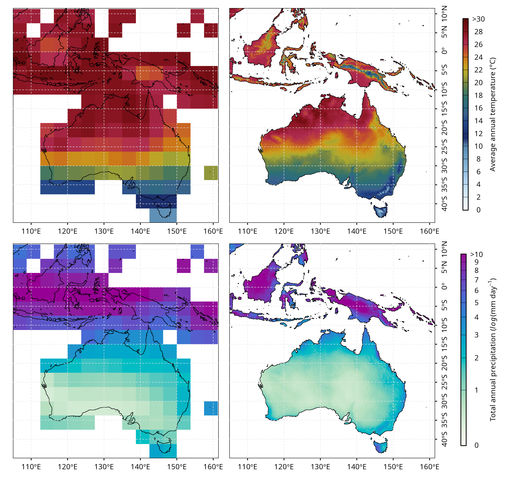

# TraCE-Sahul

Scripts for downscaling TraCE-21ka climate data using the CHELSA v1.2 algorithm for the Sahul region from 22ka BP to 1989 C.E. Additional scripts are provided to harmonise CMIP6 simulations under a range of SSP scenarios to create a seamless dataset to 2100.

!

*TraCE-21ka model output at 3.75° resolution (left) and downscaled TraCE-Sahul data at 0.05° resolution (centre), both showing 1961–1990 conditions. The right panel shows downscaled CMIP6 data under SSP5-8.5 for 2100. The top row shows average annual temperature (°C), and the bottom row shows average daily precipitation (mm/day).*

## Overview

TraCESahul provides the processing workflow used to generate high-resolution palaeoclimate data for Sahul from TraCE-21ka climate simulations. The workflow processes the pre-1500 decadal climatologies and the 1500–1990 monthly TraCE-21ka data separately, using the CHELSA v1.2 downscaling approach.

The repository also contains scripts for processing and harmonising CMIP6 data to the downscaled TraCE-Sahul data.

## Features

* Processing of decadal monthly climatologies for periods before 1500 CE.
* Processing of monthly climate data for 1500–1990 CE.
* Processing of precipitation and temperature variables.
* Spatial processing and interpolation of climate and elevation data.
* Parallelised CHELSA processing for large datasets.
* Downscaling of TraCE-21ka climate data using CHELSA v1.2.

## Installation

### System requirements

The workflow requires:
  
* [R](https://cran.r-project.org/)
* [CDO (Climate Data Operators)](https://code.mpimet.mpg.de/projects/cdo)
* [NCO (NetCDF Operators)](https://nco.sourceforge.net/)
* [GDAL](https://gdal.org/en/stable/)
* [CHELSA Paleo](https://gitlabext.wsl.ch/karger/chelsa_paleo)

The `CHELSA Paleo` python packages must be installed separately, as it is not included in this repository.

### R packages

The R scripts require several CRAN packages, including `terra`, `data.table`, and `ncdf4`. Additional packages may be required by individual scripts.

### Cloning ### 

Close the repository with:

  ```bash
git clone https://github.com/GlobalEcologyLab/TraCESahul.git
cd TraCESahul
```

The processing scripts contain paths and configuration options that should be adjusted for the local installation and location of input and output data.

## Project structure

```text
TraCESahul/
  ├── 01_code/
  │   ├── 00_functions/                    # Shared R processing functions
  │   ├── 01_Decadal_pre1500_halfdegree/   # Pre-1500 decadal processing
  │   ├── 02_Monthly_1500_1990_halfdegree/ # 1500–1990 monthly processing
  │   └── 03_CMIP6/                        # CMIP6 processing
  │
├── 02_data/
  │   ├── 01_inputs/                       # Input data
  │   ├── 02_processed/                    # Processed intermediate data
  │   └── 03_CHELSA_paleo/                 # CHELSA Paleo data
  │
├── TraCE_Sahul.Rproj
└── README.md
```

## Data

The scripts are designed to operate on large climate datasets and associated topographic and climatological inputs. Input and processed data are **not** included in the repository.

Input data requirements can be found [here](https://gdex.ucar.edu/datasets/d651050/dataaccess/), with data available for download from the [NCAR Geoscience Data Exchange](https://gdex.ucar.edu/datasets/d651050/dataaccess/).

## Citation

If you use the code or resulting datasets, please cite the associated TraCE-Sahul/CHELSA palaeoclimate work and the original TraCE-21ka and CHELSA publications.
